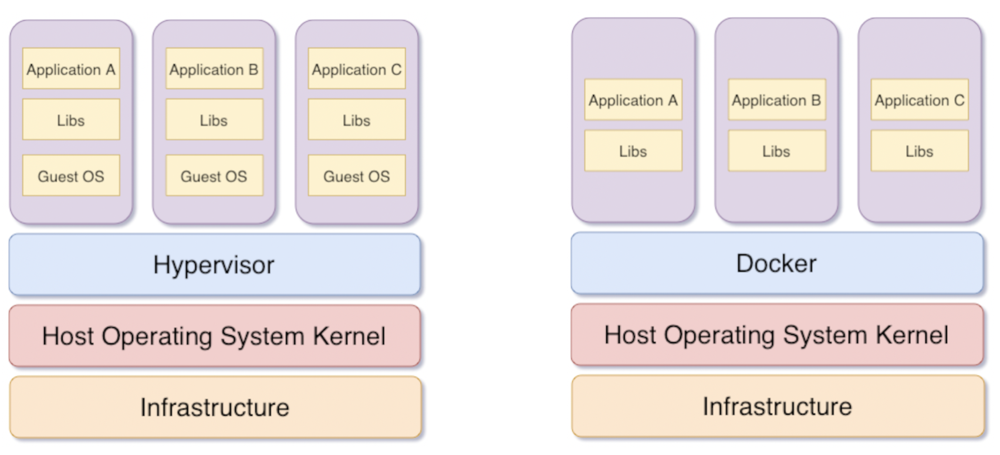
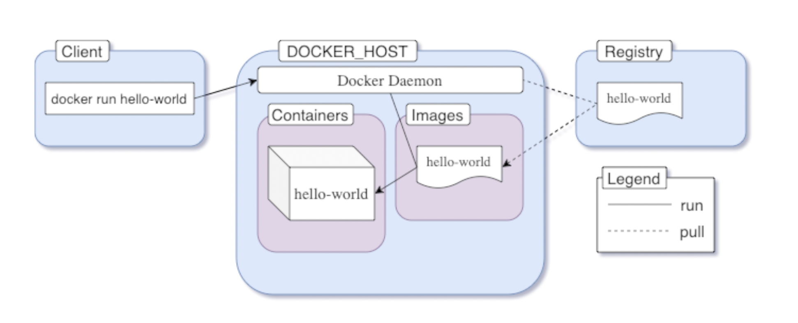
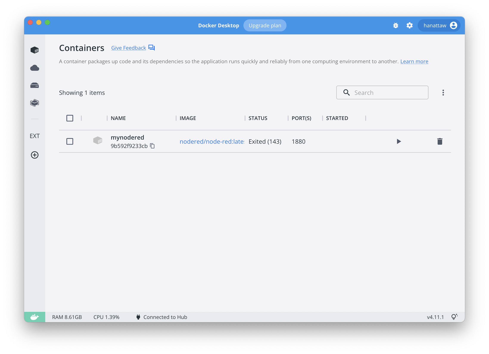
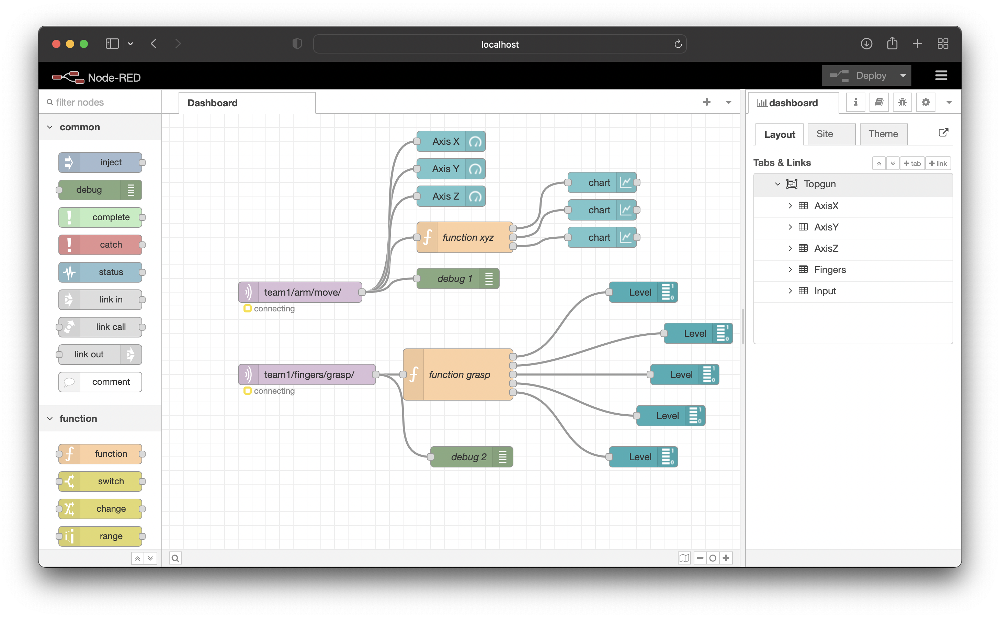
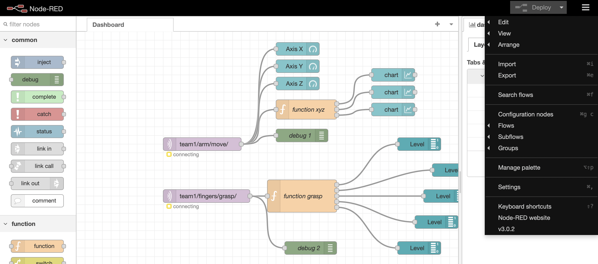
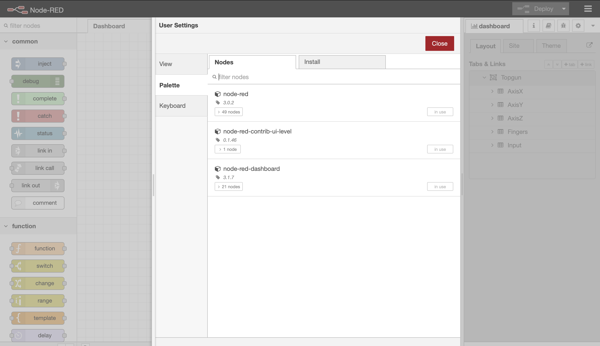
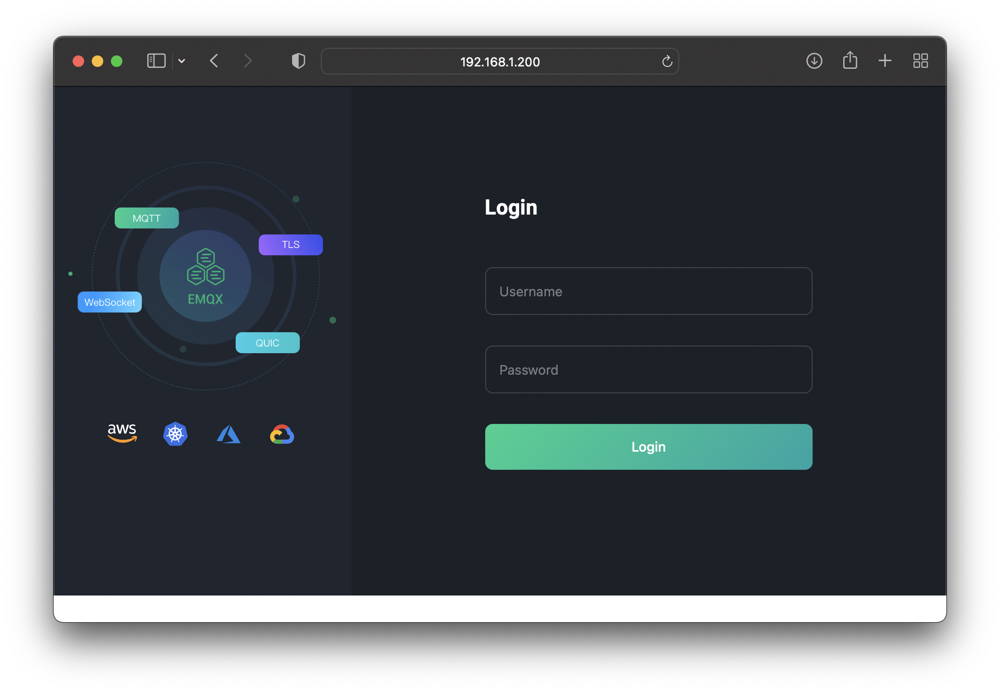

# TESA Top gun Rally #16 (การประชันทักษะด้านสมองกลฝังตัว ครั้งที่ 16)

## Server Programming and Configuration.

### Containterization

> Containerization involves **encapsulating** or **packaging** up software code and all its **dependencies** so that it can run uniformly and consistently on any infrastructure

## วันที่ 1 ##
### เรียนรู้ ###
1. พื้นฐาน containterization
2. เรียนรู้การใช้งาน container ด้วย docker
3. เรียนรู้การติดตั้งและใช้งาน MQTT Broker

### พื้นฐาน Containerization ###

**Idea**
- **Develop** and run the application inside an isolated environment (known as a **container**) that matches your final **deployment** environment.
- Put your application inside a single file (known as an **image**) along with all its dependencies and necessary deployment configurations.
- And **share** that image through a central server (known as a **registry** e.g. [Docker Hub (https://hub.docker.com)](https://hub.docker.com)) that is accessible by anyone with proper authorization.


**Docker Concept**

- Docker is an **implementation**.
- **Open-source** containerization platform.
- **Share** containers public or private registries, and also to orchestrate containers.

**Docker Architure**

A container is an abstraction at the application layer that packages code and dependencies together. **Instead of virtualizing the entire physical machine**, containers virtualize the **host operating system** only




- **Images** are multi-layered self-contained files that act as the template for creating containers. They are like a frozen, read-only copy of a container. Images can be exchanged through registries.
- **Containers** are just images in running state. When you obtain an image from the internet and run a container using that image, you essentially create another temporary writable layer on top of the previous read-only ones
- An image **registry** is a centralized place where you can upload your images and can also download images created by others. Docker Hub is the default public registry for Docker.



## Docker Desktop ##

Docker Desktop is an easy-to-install application for your Mac or Windows environment that enables you to build and share containerized applications and microservices.

It provides a simple interface that enables you to manage your containers, applications, and images directly from your machine without having to use the CLI to perform core actions.

Docker Desktop includes:

- Docker Engine
- Docker CLI client
- Docker Compose
- Docker Content Trust
- Kubernetes
- Credential Helper


[Get Started with Docker (www.docker.com/get-started/)](https://www.docker.com/get-started/)

- [Install Docker Desktop on Mac (https://docs.docker.com/desktop/install/mac-install/)](https://docs.docker.com/desktop/install/mac-install/)
- [Install Docker Desktop on Windows (https://docs.docker.com/desktop/install/windows-install/)](https://docs.docker.com/desktop/install/windows-install/)
- [Install Docker Desktop on Linux (https://docs.docker.com/desktop/install/linux-install/)](https://docs.docker.com/desktop/install/linux-install/)

### Verify Docker installation complete ###
After you’ve successfully installed Docker Desktop, you can check the versions of these binaries by running the following commands:

```bash
$ docker compose version
Docker Compose version v2.7.0

$ docker --version
Docker version 20.10.17, build 100c701

$ docker version
Client:
 Cloud integration: v1.0.28
 Version:           20.10.17
 API version:       1.41
 Go version:        go1.17.11
 Git commit:        100c701
 Built:             Mon Jun  6 23:04:45 2022
 OS/Arch:           darwin/arm64
 Context:           default
 Experimental:      true
...
```

## Run container from share image ##
**[Docker Hub(https://hub.docker.com/)](https://hub.docker.com/)** is a service provided by Docker for finding and sharing container images with your team. It is the world’s largest repository of container images with an array of content sources including container community developers, open source projects and independent software vendors (ISV) building and distributing their code in containers.


### Run docker containter from docker hub (BASIC) ###

**Node-RED**

Low-code programming for event-driven applications

[Node-RED(https://nodered.org)](https://nodered.org) is a programming tool for wiring together hardware devices, APIs and online services in new and interesting ways.

It provides a browser-based editor that makes it easy to wire together flows using the wide range of nodes in the palette that can be deployed to its runtime in a single-click


Documentation on share environment e.g. nodered is the key to start. 


**Run docker Node-RED**

To run Node-RED in Docker in its simplest form just run:

```bash
$ mkdir docker-nodered
$ cd docker-nodered
$ mkdir node_red_data
$ docker run -it -p 1880:1880 -v "$(pwd)/node_red_data:/data" --name nodered-mqtt nodered/node-red

4 Sep 15:10:03 - [info] 

Welcome to Node-RED
===================

4 Sep 15:10:03 - [info] Node-RED version: v3.0.2
4 Sep 15:10:03 - [info] Node.js  version: v16.16.0
4 Sep 15:10:03 - [info] Linux 5.10.104-linuxkit arm64 LE
4 Sep 15:10:03 - [info] Loading palette nodes
4 Sep 15:10:05 - [info] Dashboard version 3.1.7 started at /ui
4 Sep 15:10:05 - [info] Settings file  : /data/settings.js
4 Sep 15:10:05 - [info] Context store  : 'default' [module=memory]
4 Sep 15:10:05 - [info] User directory : /data
4 Sep 15:10:05 - [warn] Projects disabled : editorTheme.projects.enabled=false
4 Sep 15:10:05 - [info] Flows file     : /data/flows.json
4 Sep 15:10:05 - [info] Server now running at http://127.0.0.1:1880/
4 Sep 15:10:05 - [warn] 

---------------------------------------------------------------------
Your flow credentials file is encrypted using a system-generated key.

If the system-generated key is lost for any reason, your credentials
file will not be recoverable, you will have to delete it and re-enter
your credentials.

You should set your own key using the 'credentialSecret' option in
your settings file. Node-RED will then re-encrypt your credentials
file using your chosen key the next time you deploy a change.
---------------------------------------------------------------------

4 Sep 15:10:05 - [info] Starting flows
4 Sep 15:10:05 - [info] Started flows
4 Sep 15:10:35 - [info] [mqtt-broker:66b4ca9236e8f3eb] Connection failed to broker: mqtt://192.168.1.103:1883


```

Docker Desktop



Docker Containter

```bash
$ docker ps -a
CONTAINER ID   IMAGE                     COMMAND             CREATED      STATUS                    PORTS                    NAMES
9b592f9233cb   nodered/node-red:latest   "./entrypoint.sh"   2 days ago   Up 43 seconds (healthy)   0.0.0.0:1880->1880/tcp   mynodered

```

Login to running Node-Red



Manager pallet on Node-RED




install Dashboard ui from flows




## Run Container from docker build image. (Advance) ##
Docker Build is one of Docker Engine’s most used features. Whenever you are creating an image you are using Docker Build. Build is a key part of your **software development life cycle** allowing you to package and bundle your code and **ship it** anywhere


### Packaging your software (MQTT) ###
[EMQX (https://www.emqx.io/docs/en/v5.0/)](https://www.emqx.io/docs/en/v5.0/)
is an Open-source MQTT broker with a high-performance real-time message processing engine, powering event streaming for IoT devices at massive scale.

As the most scalable MQTT broker, EMQX can help you connect any device, at any scale. Move and process your IoT data anywhere.

1. Get the source code
```bash
$ git clone https://github.com/emqx/emqx.git

```

2. Checkout to latest tag
```bash
$ cd emqx
$ git checkout $(git describe --abbrev=0 --tags)

```


Dockerfile is the keys. [Dockerfile (https://github.com/emqx/emqx/blob/master/deploy/docker/Dockerfile)](https://github.com/emqx/emqx/blob/master/deploy/docker/Dockerfile) 

Dockerfile:

```Dockerfile
ARG BUILD_FROM=ghcr.io/emqx/emqx-builder/5.0-17:1.13.4-24.2.1-1-debian11
ARG RUN_FROM=debian:11-slim
FROM ${BUILD_FROM} AS builder

COPY . /emqx

ARG EMQX_NAME=emqx
ENV EMQX_RELUP=false

RUN export PROFILE=${EMQX_NAME%%-elixir} \
    && export EMQX_NAME1=$EMQX_NAME \
    && export EMQX_NAME=$PROFILE \
    && export EMQX_LIB_PATH="_build/$EMQX_NAME/lib" \
    && export EMQX_REL_PATH="/emqx/_build/$EMQX_NAME/rel/emqx" \
    && export EMQX_REL_FORM='docker' \
    && cd /emqx \
    && rm -rf $EMQX_LIB_PATH \
    && make $EMQX_NAME1 \
    && mkdir -p /emqx-rel \
    && mv $EMQX_REL_PATH /emqx-rel

FROM $RUN_FROM

# Elixir complains if runs without UTF-8
ENV LC_ALL=C.UTF-8
ENV LANG=C.UTF-8

COPY deploy/docker/docker-entrypoint.sh /usr/bin/
COPY --from=builder /emqx-rel/emqx /opt/emqx

RUN ln -s /opt/emqx/bin/* /usr/local/bin/

RUN apt-get update; \
    apt-get install -y --no-install-recommends ca-certificates procps; \
    rm -rf /var/lib/apt/lists/*

WORKDIR /opt/emqx

RUN groupadd -r -g 1000 emqx; \
    useradd -r -m -u 1000 -g emqx emqx; \
    chgrp -Rf emqx /opt/emqx; \
    chmod -Rf g+w /opt/emqx; \
    chown -Rf emqx /opt/emqx

USER emqx

VOLUME ["/opt/emqx/log", "/opt/emqx/data"]

# emqx will occupy these port:
# - 1883 port for MQTT
# - 8081 for mgmt API
# - 8083 for WebSocket/HTTP
# - 8084 for WSS/HTTPS
# - 8883 port for MQTT(SSL)
# - 11883 port for internal MQTT/TCP
# - 18083 for dashboard
# - 4370 default Erlang distribution port
# - 5369 for backplain gen_rpc
EXPOSE 1883 8081 8083 8084 8883 11883 18083 4370 5369

ENTRYPOINT ["/usr/bin/docker-entrypoint.sh"]

CMD ["/opt/emqx/bin/emqx", "foreground"]
```

3. Compile and run

Build image from source with **Dockerfile**
```bash
$ cd emqx
$ docker build -f deploy/docker/Dockerfile -t hanattaw/emqx . # change to your [yourname]/emqx

[+] Building 728.8s (16/16) FINISHED         
 => [internal] load build definition from Dockerfile              0.0s
 => => transferring dockerfile: 37B                               0.0s
 => [internal] load .dockerignore                                 0.0s

...
 
 => => naming to docker.io/hanattaw/emqx                          0.0s

Use 'docker scan' to run Snyk tests against images to find vulnerabilities and learn how to fix them
```

Check build images exist

```bash
$ docker images
REPOSITORY       TAG      IMAGE ID       CREATED        SIZE
hanattaw/emqx    latest   168a41fd5ed1   2 hours ago    494MB
```

## Run Container from build image ##

**Run Docker**

```bash
$ mkdir docker-emqx # create folder
$ cd docker-emqx
$ mkdir emqx_log emqx_data # create log and data directories
$ docker run -d --name emqx517 -p 1883:1883 -p 8083:8083 -p 8084:8084 -p 8883:8883 -p 18083:18083 -v "$(pwd)/emqx_log:/opt/emqx/log" -v "$(pwd)/emqx_data:/opt/emqx/data" hanattaw/emqx:latest # from build image tag

bd823a28818343b59f83ea904eaf3df3991780724e61905f546520a57c114408
```

**Process of running containter**

```bash
$ docker ps -a
CONTAINER ID   IMAGE                  COMMAND                  CREATED       STATUS         PORTS                                                                                                                                                                                                                                         NAMES
f1080c969719   hanattaw/emqx:latest   "/usr/bin/docker-ent…"   4 hours ago   Up 9 seconds   4370/tcp, 5369/tcp, 0.0.0.0:1883->1883/tcp, :::1883->1883/tcp, 0.0.0.0:8083-8084->8083-8084/tcp, :::8083-8084->8083-8084/tcp, 8081/tcp, 0.0.0.0:8883->8883/tcp, :::8883->8883/tcp, 0.0.0.0:18083->18083/tcp, :::18083->18083/tcp, 11883/tcp emqx517

```

From your computer, open a browser and navigate to [http://localhost:18083](http://localhost:18083) or, if you’re using Play with Docker, click on Open Port.




**stop container**

```bash
$ docker stop emqx517
emqx517

```

**start container**
```bash
$ docker start emqx517
emqx517

```

**rm stopped container**

```bash
$ docker rm emqx517
emqx517
```

## MQTTX desktop client tool ##
MQTTX is an elegant cross-platform MQTT 5.0 open source desktop client tool that supports running on macOS, Linux, and Windows.

MQTTX has many features. It provides a concise graphical interface with intuitive operational functionality. It supports MQTT/MQTT over WebSocket access with one-way/two-way SSL authentication, and supports Payload format conversion, simulation of test data with a custom scripts, automatic subscription of $SYS topic, viewing Traffic statistics, and more.

For download and use, please refer to the [MQTT X website(https://mqttx.app/)](https://mqttx.app/)


### Client example code ###
For MQTT client library example code, we try to cover as many mainstream programming languages and platforms as possible, see M[QTT-Client-Examples](https://github.com/emqx/MQTT-Client-Examples) .


## Top Gun Rally CDTI 2022 Day 1 Excercise ##


1. Install docker, docker desktop.
2. **[Basic]** Run Node-Red docker.
3. **[Advance]** Build EMQX docker image and run EMQX from image.
   - **[Advance]** Setup MQTT authentication.
   - **[Advance]** Setup Topic authorization.
4. **[Basic]** Publish and Subscibe to MQTT Broker.
   - For who are not complete building EMQX Broker from image. You can run EMQX docker by pulling from [EMQX docker official image (https://hub.docker.com/_/emqx)](https://hub.docker.com/_/emqx).

     ```bash 
     $ docker run -d --name emqx -p 1883:1883 -p 8083:8083 -p 8084:8084 -p 8883:8883 -p 18083:18083 emqx/emqx:latest

     ```
   - Or connect to Top Gun Rally [CDTI 2022 MQTT (mqtt://172.21.16.10)](mqtt://172.21.16.10:1883) with 
     - username: team[x]
     - password: team[x]

     

